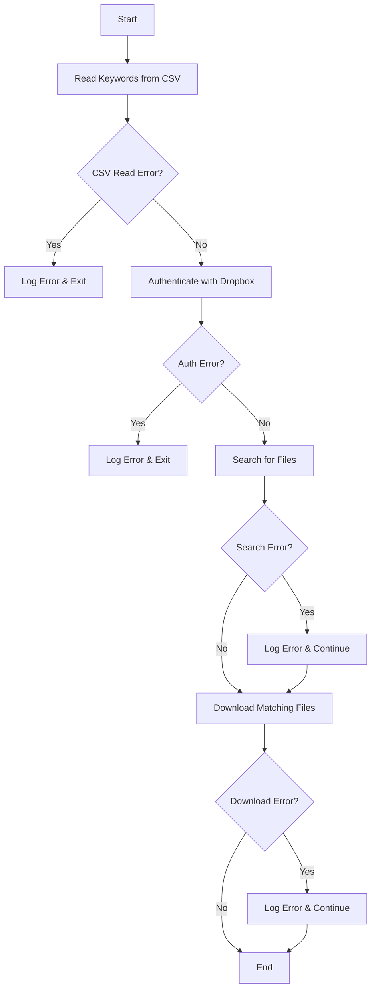

# Dropbox Bulk Search and Download

[](https://www.python.org/downloads/)
[](LICENSE)
[](https://www.dropbox.com/developers/documentation)
[](https://github.com/yourusername/dropbox-bulk-search-download/graphs/commit-activity)
[](https://shobhit.net/)

A Python script that allows you to search for files in your Dropbox account using keywords from a CSV file and download all matching files to a local directory.

## Author

**Shobhit Kumar Prabhakar**
- Website: [https://shobhit.net/](https://shobhit.net/)
- GitHub: [@GeekLord](https://github.com/GeekLord)

## Features

- Read search keywords from a CSV file
- Search for files in Dropbox using multiple keywords
- Download matching files to a local directory
- Automatic duplicate file handling
- Rate limiting protection
- Detailed progress logging
- Error handling and reporting

## Prerequisites

- Python 3.6 or higher
- Dropbox account
- Dropbox API access token
- Required Python packages:
  - `dropbox`

## Installation

1. Clone this repository:
```bash
git clone https://github.com/GeekLord/dropbox-bulk-search-download.git
cd dropbox-bulk-search-download
```

2. Install the required packages:
```bash
pip install dropbox
```

## Configuration

1. Create a `keywords.csv` file in the same directory as the script. Each keyword should be on a new line:
```csv
keyword1
keyword2
keyword3
```

2. Get your Dropbox API access token:
   - Go to [Dropbox App Console](https://www.dropbox.com/developers/apps)
   - Create a new app or select an existing one
   - Generate an access token with the following permissions:
     - `files.metadata.read`
     - `files.content.read`

3. Update the configuration variables in the script:
```python
CSV_FILE_PATH = "keywords.csv"
DROPBOX_TOKEN = "YOUR_DROPBOX_ACCESS_TOKEN"
DROPBOX_FOLDER_PATH = ""  # Root folder by default, specify a path if needed
LOCAL_DOWNLOAD_FOLDER = "downloaded_files"
```

## Usage

1. Run the script:
```bash
python dropbox_bulk_search_download.py
```

2. The script will:
   - Read keywords from your CSV file
   - Authenticate with Dropbox
   - Search for files matching each keyword
   - Download all matching files to the specified local folder
   - Skip any duplicate files
   - Display progress and results in the console

## API Documentation

### Functions

#### `read_keywords_from_csv(csv_file_path)`
Reads keywords from a CSV file, skipping the header row.

**Parameters:**
- `csv_file_path` (str): Path to the CSV file containing keywords

**Returns:**
- `list`: List of keywords extracted from the CSV

**Example:**
```python
keywords = read_keywords_from_csv("keywords.csv")
```

#### `authenticate_dropbox(access_token)`
Authenticates to Dropbox using the provided access token.

**Parameters:**
- `access_token` (str): Dropbox API access token

**Returns:**
- `dropbox.Dropbox`: Authenticated Dropbox instance or None if authentication fails

**Example:**
```python
dbx = authenticate_dropbox("your_access_token")
```

#### `search_files_by_keyword(dbx, keyword, path="")`
Searches for files in Dropbox folder that match the given keyword.

**Parameters:**
- `dbx` (dropbox.Dropbox): Authenticated Dropbox instance
- `keyword` (str): Keyword to search for
- `path` (str): Dropbox folder path to search in (optional)

**Returns:**
- `list`: List of matching file metadata dictionaries containing:
  - `path`: Full Dropbox path of the file
  - `name`: Basename of the file

**Example:**
```python
matching_files = search_files_by_keyword(dbx, "document", "/Documents")
```

#### `download_file(dbx, dropbox_file_path, local_folder_path)`
Downloads a file from Dropbox to a local folder.

**Parameters:**
- `dbx` (dropbox.Dropbox): Authenticated Dropbox instance
- `dropbox_file_path` (str): Path of the file in Dropbox
- `local_folder_path` (str): Local folder where the file will be downloaded

**Returns:**
- `bool`: True if download successful, False otherwise

**Example:**
```python
success = download_file(dbx, "/path/to/file.pdf", "downloads")
```

## Screenshots and Diagrams

### Workflow Diagram


### File Structure
```
dropbox-bulk-search-download/
├── dropbox_bulk_search_download.py
├── keywords.csv
├── downloaded_files/
└── README.md
```

## Output

- Downloaded files will be saved in the `downloaded_files` folder (or your specified `LOCAL_DOWNLOAD_FOLDER`)
- The script will print progress information to the console, including:
  - Number of keywords found
  - Search results for each keyword
  - Download progress
  - Any errors or issues encountered

## Error Handling

The script includes comprehensive error handling for:
- CSV file reading errors
- Dropbox authentication issues
- Search API errors
- Download failures
- File system errors

## Rate Limiting

The script includes a 1-second delay between searches to avoid hitting Dropbox's API rate limits.

## Contributing

Contributions are welcome! Please feel free to submit a Pull Request. For major changes, please open an issue first to discuss what you would like to change.

## License

This project is licensed under the MIT License - see the LICENSE file for details.

## Author

Created by [Shobhit Kumar Prabhakar](https://shobhit.net/)

## Disclaimer

This script is not affiliated with or endorsed by Dropbox. Make sure to comply with Dropbox's terms of service and API usage guidelines when using this script. 